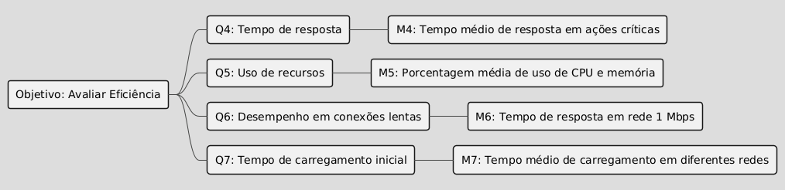

# GQM – Fase Definição

## Objetivo de negócio do AGROMART

Solução web e mobile com o objetivo de facilitar a relação entre os pequenos agricultores e os consumidores, visando proporcionar ao pequeno agricultor uma maior garantia para o escoamento de sua produção e ajudar pessoas que buscam uma alimentação mais saudável e de qualidade a encontrar seus produtos.

---

## Objetivo de Medição 1: Usabilidade

| Elemento                 | Descrição                                                                            |
| ------------------------ | ------------------------------------------------------------------------------------ |
| **Analisar**             | Agromart                                                                             |
| **Para o propósito de**  | entender a facilidade de uso e satisfação do usuário                               |
| **Com respeito a**       | usabilidade da interface e experiência do usuário                                  |
| **Do ponto de vista da** | usuários finais (agricultores e consumidores)                                      |
| **No contexto de**       | uso real em dispositivos móveis e web                                              |

### Questões e Hipóteses

- **Q1:** Os usuários conseguem navegar facilmente pelas funcionalidades principais do sistema?  
  **Hipótese Q1:** Uma parte dos usuários pode encontrar dificuldades em acessar e utilizar os recursos principais (ex: busca de produtos, cadastro de itens).

- **Q2:** Os usuários estão satisfeitos com o design e a responsividade da interface?  
  **Hipótese Q2:** A interface adaptada para dispositivos web é melhor avaliada em testes de usabilidade.

- **Q3:** O tempo necessário para realizar tarefas básicas é compatível com as expectativas dos usuários?  
  **Hipótese Q3:** Usuários levam menos de 2 minutos para realizar ações como cadastrar produtos ou realizar pedidos.

### Abstraction Sheet

<table style="width:100%; border-collapse: collapse;">
    <thead style="width: 50%; padding: 10px; vertical-align: top; border: 1px solid #ccc;">
        <tr>
            <th>Objeto</th>
            <th>Propósito</th>
            <th>Foco da Qualidade</th>
            <th>Ponto de Vista</th>
        </tr>
    </thead>
    <tbody style="width: 50%; padding: 10px; vertical-align: top; border: 1px solid #ccc;">
        <tr>
            <td>Produto Entregue</td>
            <td>Compreensão</td>
            <td>Usabilidade</td>
            <td>Usuário Final</td>
        </tr>
    </tbody>
</table>

<table style="width:100%; border-collapse: collapse;">
  <tr>
    <td style="width: 50%; padding: 10px; vertical-align: top; border: 1px solid #ccc;">
      <strong>Foco da Qualidade</strong>
      <ul style="margin-top: 5px;">
        <li>Facilidade de uso</li>
        <li>Satisfação visual</li>
        <li>Tempo para realizar tarefas</li>
      </ul>
    </td>
    <td style="width: 50%; padding: 10px; vertical-align: top; border: 1px solid #ccc;">
      <strong>Fatores de Variação</strong>
      <ul style="margin-top: 5px;">
        <li>Experiência prévia do usuário</li>
        <li>Qualidade do design UI/UX</li>
        <li>Complexidade da tarefa</li>
      </ul>
    </td>
  </tr>
  <tr>
    <td style="padding: 10px; vertical-align: top; border: 1px solid #ccc;">
      <strong>Hipótese de Baseline</strong>
      <ul style="margin-top: 5px;">
        <li>80% dos usuários completam tarefas</li>
        <li>NPS acima de 7</li>
      </ul>
    </td>
    <td style="padding: 10px; vertical-align: top; border: 1px solid #ccc;">
      <strong>Impacto dos Fatores de Variação</strong>
      <ul style="margin-top: 5px;">
        <li><em>Usuários mais experientes:</em> concluem tarefas 30% mais rápido</li>
        <li><em>UI com contraste e responsividade:</em> melhora a satisfação</li>
      </ul>
    </td>
  </tr>
</table>

### Especificação da Avaliação
#### Métricas e Critérios

| Questão | Métrica (Q-RAPID)                     | Unidade        | Nível Aceitável | Critério de Julgamento                     |
|---------|----------------------------------------|----------------|-----------------|--------------------------------------------|
| Q1      | Taxa de conclusão de tarefas           | %              | ≥ 80%           | < 70% = Crítico; 70-79% = Alerta           |
| Q2      | Pontuação SUS (Usabilidade)            | Escala 0-100   | ≥ 75            | < 68 = Insatisfatório                      |
| Q3      | Tempo médio por tarefa                 | Segundos       | ≤ 120s          | > 150s = Necessita otimização              |

#### Gráfico Hierárquico

<strong>Figura 1 - Diagrama de Objetivo de Medição 1: Usabilidade</strong>

---

## Objetivo de Medição 2: Eficiência

| Elemento                 | Descrição                                                                            |
| ------------------------ | ------------------------------------------------------------------------------------ |
| **Analisar**             | Agromart                                                                             |
| **Para o propósito de**  | avaliar seu desempenho sob diferentes condições de uso                             |
| **Com respeito a**       | eficiência em termos de tempo de resposta, uso de recursos e escalabilidade       |
| **Do ponto de vista da** | equipe técnica                                                                      |
| **No contexto de**       | uso real em dispositivos móveis, desktops e diferentes conexões de internet       |

### Questões e Hipóteses

- **Q4:** O sistema responde às ações do usuário em tempo aceitável?  
  **Hipótese Q4:** O tempo médio de resposta das ações críticas é inferior a 1 segundo em 90% dos testes.

- **Q5:** O consumo de memória e CPU permanece dentro de limites aceitáveis durante o uso?  
  **Hipótese Q5:** O uso de memória e CPU não ultrapassa 70% dos recursos disponíveis em dispositivos de teste.

- **Q6:** O desempenho se mantém estável em diferentes velocidades de conexão?  
  **Hipótese Q6:** A aplicação mantém funcionalidade básica e responde em até 3 segundos mesmo em conexões de 1 Mbps.

- **Q7:** O tempo de carregamento inicial do sistema é adequado?  
  **Hipótese Q7:** O sistema carrega completamente em até 2 segundos em redes Wi-Fi e até 5 segundos em redes móveis.

### Abstraction Sheet

<table style="width:100%; border-collapse: collapse;">
    <thead style="width: 50%; padding: 10px; vertical-align: top; border: 1px solid #ccc;">
        <tr>
            <th>Objeto</th>
            <th>Propósito</th>
            <th>Foco da Qualidade</th>
            <th>Ponto de Vista</th>
        </tr>
    </thead>
    <tbody style="width: 50%; padding: 10px; vertical-align: top; border: 1px solid #ccc;">
        <tr>
            <td>Produto Entregue</td>
            <td>Avaliação</td>
            <td>Eficiência</td>
            <td>Equipe de Desenvolvimento</td>
        </tr>
    </tbody>
</table>

<table style="width:100%; border-collapse: collapse;">
  <tr>
    <td style="width: 50%; padding: 10px; vertical-align: top; border: 1px solid #ccc;">
      <strong>Foco da Qualidade</strong>
      <ul style="margin-top: 5px;">
        <li>Comportamento em relação ao tempo</li>
        <li>Utilização de recursos</li>
        <li>Capacidade</li>
      </ul>
    </td>
    <td style="width: 50%; padding: 10px; vertical-align: top; border: 1px solid #ccc;">
      <strong>Fatores de Variação</strong>
      <ul style="margin-top: 5px;">
        <li>Grau em que os tempos de resposta e processamento atendem aos requisitos</li>
        <li>Grau em que as quantidades e tipos de recursos utilizados pelo sistema atendem aos requisitos</li>
        <li>Grau em que os limites máximos de um parâmetro do sistema atendem aos requisitos</li>
      </ul>
    </td>
  </tr>
  <tr>
    <td style="padding: 10px; vertical-align: top; border: 1px solid #ccc;">
      <strong>Hipótese de Baseline</strong>
      <ul style="margin-top: 5px;">
        <li>Tempo de resposta para APIs críticas abaixo de 200ms</li>
        <li>Cobertura de testes unitários acima de 80% para novas funcionalidades</li>
      </ul>
    </td>
    <td style="padding: 10px; vertical-align: top; border: 1px solid #ccc;">
      <strong>Impacto dos Fatores de Variação</strong>
      <ul style="margin-top: 5px;">
        <li><em>Otimização de consultas ao banco de dados e uso de cache:</em> podem reduzir significativamente a latência</li>
        <li><em>Adoção de práticas de TDD:</em> aumenta a cobertura e a qualidade</li>
      </ul>
    </td>
  </tr>
</table>

### Especificação da Avaliação
#### Métricas e Critérios

| Questão | Métrica (Q-RAPID)              | Unidade        | Nível Aceitável     | Critério de Julgamento               |
|---------|---------------------------------|----------------|---------------------|--------------------------------------|
| Q4      | Latência de resposta            | ms             | ≤ 1000              | > 1500ms = Falha                     |
| Q5      | Uso médio de CPU                | %              | ≤ 70%               | > 85% = Risco de instabilidade       |
| Q6      | Tempo resposta (1Mbps)          | ms             | ≤ 3000              | > 4000ms = Inaceitável               |
| Q7      | Tempo carregamento inicial      | segundos       | ≤ 5 (mobile)        | > 8s = Necessita otimização          |

#### Gráfico Hierárquico

<strong>Figura 2 - Diagrama de Objetivo de Medição 2: Eficiência</strong>

---

## Tabela de Contribuição

| Matrícula | Nome completo                       | Contribuição (%) |
| --------- | ----------------------------------- | ---------------- |
| 190102977 | Artur Ricardo dos Santos Lopes      | 16,7%            |
| 221007690 | Diego Carlito Rodrigues de Souza    | 16,7%            |
| 221008060 | Gabriel Moura dos Santos            | 16,7%            |
| 211029361 | João Pedro Nóbrega Fernandes        | 16,7%            |
| 221008300 | Marcos Antonio Teles de Castilhos   | 16,7%            |
| 221008481 | Víctor Moreira Almeida              | 16,7%            |

## Histórico de Versão

| Versão | Data       | Autor                                      | Descrição            | Revisor |
| ------ | ---------- | ------------------------------------------ | -------------------- | ------- |
| `1.0`    | 27/05/2025 | [Diego Carlito](https://github.com/DiegoCarlito) | Criação do documento | [Gabriel Moura](https://github.com/thegm445) |
| `1.1`    | 28/05/2025 | [Diego Carlito](https://github.com/DiegoCarlito) | Melhora o Abstraction Sheet | [Gabriel Moura](https://github.com/thegm445) |
